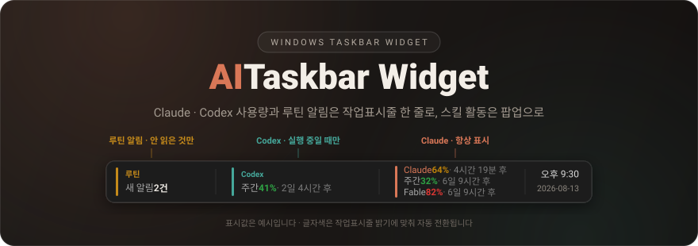
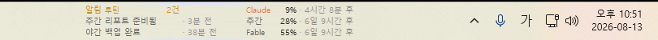
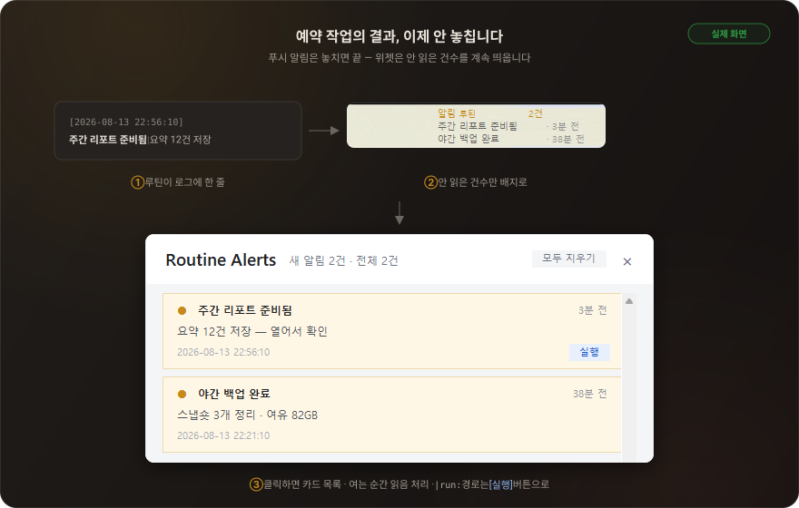
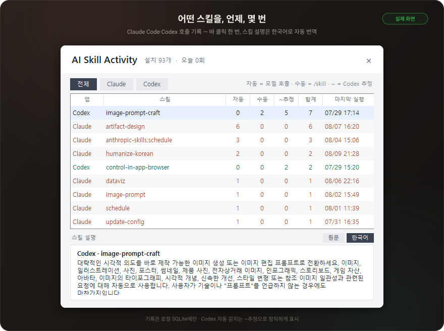

<div align="center">



<br>

[](#설치)
[](#설치)
[](CHANGELOG.md)
[](LICENSE)

**[설치](#설치)** · **[업데이트 알림](#업데이트-알림)** · **[화면 구성](#화면-구성)** · **[루틴 알림](#루틴-알림)** · **[스킬 집계](#스킬-집계)** · **[개인정보](#네트워크와-개인정보)** · **[패치 이력](CHANGELOG.md)**

</div>

---

<table>
<tr>
<td width="33%" valign="top"><b>📊 잔량이 항상 눈앞에</b><br><sub>세션·주간·모델별 잔량과 리셋 시각, 위험도는 색으로.</sub></td>
<td width="33%" valign="top"><b>🧮 Codex도 공식 수치로</b><br><sub>Codex 앱과 같은 사용량 API 직접 조회, 실행 중일 때만 표시.</sub></td>
<td width="33%" valign="top"><b>🔔 루틴 결과 안 놓침</b><br><sub>안 읽은 건수만 배지로, 여는 순간 읽음 처리.</sub></td>
</tr>
<tr>
<td width="33%" valign="top"><b>🧩 스킬 사용 집계</b><br><sub>어떤 스킬을 언제 몇 번 썼는지 팝업으로.</sub></td>
<td width="33%" valign="top"><b>👻 작업표시줄에 스며듦</b><br><sub>배경 위장 · 전체화면 회피 · 밝기 따라 글자색.</sub></td>
<td width="33%" valign="top"><b>🔒 로컬 우선</b><br><sub>프롬프트 저장 0 · 추가 모델 토큰 0 · 통신처 전부 공개.</sub></td>
</tr>
</table>

## 설치

```powershell
git clone https://github.com/KimJinWooDa/ai-taskbar-widget.git
```

그다음 **`ai-taskbar-widget` 폴더의 `install.cmd`를 더블클릭**하면 끝입니다.
Python도, 빌드도, 실행 정책 설정도 필요 없습니다 — 최신 릴리스 EXE를 받아
SHA-256을 확인한 뒤 설치합니다. (git이 없으면 GitHub의 `Code → Download ZIP`을
풀어서 똑같이 `install.cmd`를 더블클릭하면 됩니다.)

> [!NOTE]
> 설치가 끝나면 작업표시줄 오른쪽에 사용량 바가 나타납니다. 이후 새 버전은
> 위젯이 알아서 받아 설치하고, **무엇이 바뀌었는지 바의 '업데이트' 패널로
> 알려 줍니다** → [업데이트 알림](#업데이트-알림)

<details>
<summary><b>설치가 하는 일 · 제거 · 직접 빌드</b></summary>

<br>

- `dist\`에 직접 빌드한 EXE가 있으면 그걸, 없으면 GitHub 최신 릴리스 EXE를
  받습니다 (GitHub가 파일마다 주는 SHA-256과 다르면 설치하지 않음)
- EXE를 `%LOCALAPPDATA%\AI-Skill-Widget`에 복사하고 로그온 예약 작업으로
  자동 시작에 등록
- Claude 훅을 기존 설정에 **병합** — 기존 `~/.claude/settings.json`은
  `settings.json.skill-widget.bak`으로 백업
- 이미 설치돼 있어도 다시 실행하면 그대로 덮어써 고쳐집니다 — 설정과 기록은 유지

제거는 **`uninstall.cmd` 더블클릭**(스킬 호출 기록 DB는 보존).

직접 빌드하려면 Python 3.10+에서 `.\build.ps1` → `install.cmd` 순서로 실행합니다.
PowerShell에서 바로 돌리려면 `powershell -ExecutionPolicy Bypass -File .\install.ps1`
(`-FromRelease`를 붙이면 `dist\`가 있어도 릴리스를 받습니다).

</details>

## 업데이트 알림

- 위젯이 **6시간마다** 새 릴리스를 확인해 받아 설치하고 스스로 재시작합니다.
  받은 파일은 SHA-256이 맞아야만 교체에 씁니다.
- 재시작 직후 바 왼쪽에 파란 **'업데이트' 패널**이 뜹니다. 누르면 이전
  버전부터 지금까지의 패치노트가 열리고(오프라인에서도 — 패치노트가 EXE에
  들어 있음), 우클릭하면 그냥 닫힙니다. 안 눌러도 3일 뒤 내려갑니다.
  `바 위치 잠금`으로 클릭이 통과하는 바라면 패널과 알림이 트레이 메뉴
  `업데이트 소식 보기`를 가리킵니다.
- 트레이 메뉴 `새 버전 자동 설치`를 끄면 설치 전에 패널이 먼저 뜹니다 —
  건너뛴 버전들의 패치노트를 모두 보고 **`지금 설치`** 한 번으로 끝납니다.
- 설치가 실패하면 이유와 **`다시 시도`** 버튼이 나오고, 그래도 안 되면
  `install.cmd`를 다시 실행하면 됩니다(설정·기록 유지).
- 지난 변경 내용은 언제든 트레이 메뉴 `업데이트 소식 보기`로 볼 수 있습니다.
  바로 위 `현재 버전` 줄에 지금 버전과 최신 여부(새 버전이 있으면 그 번호)가
  나옵니다.

## 화면 구성

<div align="center">



<sub>실제 화면 — 글자색은 작업표시줄 밝기에 맞춰 자동 전환됩니다</sub>

</div>

<br>

| 패널 | 언제 보이나 | 내용 |
|---|---|---|
| **Claude 사용량** | 항상 | 세션·주간·모델별 잔량과 리셋 시각 |
| **Codex 사용량** | Codex 실행 중일 때만 | 계정에 있는 창(일간·주간)만, 보통 한 줄 |
| **루틴 알림** | 안 읽은 알림이 있을 때만 | 안 읽은 결과 건수 |

> [!TIP]
> 퍼센트 기본은 **"쓴 비율"**(0%에서 시작) — Codex 앱의 "남은 100%"가 위젯에선
> 0%입니다. 트레이 메뉴 `사용량을 남은 비율로 표시`를 켜면 남은 비율로 바뀝니다.

<details>
<summary><b>동작 세부</b></summary>

<br>

- 바는 **오른쪽 끝(트레이 쪽)이 앵커** — 알림 패널이 나타났다 사라져도 사용량
  패널은 제자리, 바가 바깥쪽으로만 늘었다 줄어듭니다. 패널 폭은 내용 맞춤.
- 배경은 바 양옆 작업표시줄을 0.5초마다 확인해 **1초 안에** 같은 색으로
  맞춥니다 — 반투명 작업표시줄이 뒤의 창·게임에 따라 색이 바뀌어도 따라가고,
  바가 숨어 있는 동안(전체화면)은 화면을 읽지 않습니다.
- Codex 값은 Codex 로그인(auth.json)으로 **공식 사용량을 직접 조회**합니다.
  조회가 안 되면(오프라인·토큰 만료) 세션 로그의 마지막 기록으로 폴백하며,
  이 값은 과거 기록이라 실제와 다를 수 있습니다.
- 스킬 활동은 바에 표시하지 않습니다 → [스킬 집계](#스킬-집계)

</details>

## 루틴 알림



루틴이 로그에 **한 줄** 남기면 끝입니다. 맨 끝에 `|run:<절대경로>`를 붙이면
그 알림에만 **[실행] 버튼**이 생깁니다.

```
[yyyy-MM-dd HH:mm:ss] 제목 | 본문
[yyyy-MM-dd HH:mm:ss] 제목 | 본문 |run:C:\경로\할것.bat
```

> [!WARNING]
> **본문에 비밀값(토큰·키·비밀번호)을 넣지 마세요** — 로그는 평문입니다.
> 위젯은 이 파일을 읽기만 하고, 내용을 어디로도 보내지 않습니다.

<details>
<summary><b>전체 규칙 — 동작 · [실행] 버튼 · 경로 변경 · <code>notify.ps1</code></b></summary>

<br>

- 안 읽은 알림이 **0건이면 패널을 아예 그리지 않습니다.** 빈 아이콘이 자리를
  차지하지 않고, 나머지 패널이 빈틈없이 당겨집니다.
- 패널을 클릭하면 최근 100건이 최신순 카드 목록으로 열리고, **여는 순간 읽음
  처리**됩니다. 바가 잠겨 있으면 트레이 메뉴의 `루틴 알림 열기`를 씁니다.
- 목록이 열려 있는 사이에 도착한 알림은 **읽음 처리하지 않습니다.**
- `모두 지우기`는 **위젯의 표시 상태만** 지웁니다 — 루틴이 쓰는 기록 파일은
  그대로 남고, 이후 알림은 평소처럼 쌓입니다.
- **[실행] 버튼**: 위젯은 디스크에 실제로 있는 **절대경로 하나만** 인정합니다.
  누르면 전체 경로를 보여주며 확인을 받은 뒤 탐색기에서 더블클릭한 것과 같은
  방식으로 엽니다. **명령줄은 받지 않습니다** — 인자·파이프·리다이렉션이 낄
  자리가 없고, 없는 파일이면 버튼이 아예 안 생깁니다.
- 제목에는 파이프(`|`)를 쓰지 않습니다(본문은 허용). 형식이 안 맞는 줄도
  버리지 않고 본문으로 표시하며, 로그가 없으면 알림 기능만 조용히 쉽니다.

| | 기본값 | 바꾸는 법 |
|---|---|---|
| 로그 | `%USERPROFILE%\.claude\scheduled-tasks\notifications.log` | `CLAUDE_NOTIFY_LOG` |
| 폴더 | `%USERPROFILE%\.claude\scheduled-tasks` | `CLAUDE_NOTIFY_DIR` |
| 읽음 상태 | `%APPDATA%\ClaudeUsageWidget\notifications-read.json` | `CLAUDE_NOTIFY_STATE` |

발신 쪽은 설치 프로그램이 넣어 두는 `notify.ps1` 한 줄이면 됩니다 — 로그 기록과
윈도우 배너(닫을 때까지 남는 `reminder` 시나리오)를 함께 처리합니다:

```powershell
powershell -ExecutionPolicy Bypass -File "$env:USERPROFILE\.claude\scheduled-tasks\notify.ps1" -Title "제목" -Message "한 줄 결과"
```

- 직접 파일에 덧붙여도 되고 다른 언어로 써도 됩니다 — 위젯이 보는 것은 로그
  한 줄뿐입니다.
- `notify.ps1`은 줄바꿈을 공백으로 접고 제목의 파이프를 `/`로 바꿔
  "한 줄 = 한 알림" 계약을 지킵니다 — 본문에 로그 형식을 흉내 낸 문자열이
  들어와도 가짜 항목이 생기지 않습니다.
- 로그가 2000줄을 넘으면 최근 1000줄만 남깁니다(길이가 곧 읽기 비용).

</details>

## 스킬 집계



<details>
<summary><b>집계 기준과 한계</b></summary>

<br>

바를 클릭하거나 트레이 메뉴의 `스킬 사용 내역 열기`로 팝업을 엽니다.
`바 위치 잠금`이 켜져 클릭이 통과하면 트레이 메뉴를 씁니다.

| 앱 | 수동 호출 | 자동 호출 |
|---|---|---|
| Claude Code | `/skill` 직접 실행을 정확히 집계 | `Skill` 도구 호출을 정확히 집계 |
| Codex | `$skill` 입력을 집계 | 세션에서 `SKILL.md` 로드를 감지해 `~추정` 표시 |

- Codex에는 아직 전용 `PreSkillUse` 훅이 없어 자동/수동을 모두 정확히
  구분한다고 가장하지 않습니다. 전용 이벤트가 생기면 어댑터만 교체하면 됩니다.
- Windows 기본 `숨겨진 아이콘(^)` 창에는 임의 UI를 안전하게 넣을 수 없어,
  트레이 아이콘이 여는 전용 팝업으로 같은 흐름을 구현했습니다.

</details>

## 네트워크와 개인정보

위젯이 여는 네트워크 연결은 아래 표가 **전부**입니다.

| 언제 | 어디로 | 무엇을 |
|---|---|---|
| Claude 사용량 조회 | `api.anthropic.com` | 로그인 토큰으로 잔량만 읽기 |
| Claude 토큰 갱신 | `platform.claude.com` | 만료된 로그인 토큰 갱신 |
| Codex 사용량 조회 | `chatgpt.com` | auth.json 토큰으로 잔량만 읽기 |
| 업데이트 확인 (6시간마다) | `api.github.com` | 최신 릴리스 버전·패치노트만 읽기 |
| 업데이트 설치 (자동, 끌 수 있음) · `install.cmd` | `github.com` | 릴리스의 새 EXE 다운로드 |
| 업데이트 확인 (소스 실행일 때만) | `raw.githubusercontent.com` | CHANGELOG.md 읽기 |
| 스킬 설명 번역 | `translate.googleapis.com` | 스킬 설명 텍스트(공개 문서)만 |

<details>
<summary><b>저장하지 않는 것</b></summary>

<br>

- 원문 프롬프트와 응답은 **저장하지 않습니다.**
- 훅은 모델을 호출하지 않으며 stdout과 `additionalContext`를 출력하지 않습니다 —
  추적 때문에 추가되는 모델 입력 토큰은 **0**입니다.
- Codex는 훅 없이 기존 로컬 세션 JSONL을 증분 읽기합니다.
- 로컬 SQLite(`%APPDATA%\ClaudeUsageWidget\skill-usage.db`)에는 스킬명, 앱,
  시각, 자동/수동/추정 구분만 기록합니다. 훅은 DB를 열지 않고 같은 폴더의
  `skill-events.jsonl`에 이벤트 한 줄(해시 ID·스킬명·시각)만 남기며, 위젯이
  그걸 DB로 옮깁니다. DB가 손상되면 원본을 `.corrupt-날짜` 사본으로 남기고
  읽을 수 있는 기록을 새 파일로 옮겨 스스로 복구합니다.
- `장수 토큰 등록`으로 넣은 토큰은 `config.json`에 평문이 아니라 Windows
  계정에 묶인 DPAPI로 암호화해 저장합니다.
- 루틴 알림 로그는 읽기만 — 쓰거나 지우지 않고, 어디로도 보내지 않습니다.
- 사용량 조회에 쓰는 토큰은 저장하거나 다른 곳으로 전송하지 않습니다.

</details>

## 개발 빌드

Python 3.10+ 환경에서:

```powershell
Set-ExecutionPolicy -Scope Process Bypass
.\build.ps1                                  # dist\AI-Skill-Widget.exe + SkillEventHook.exe
python -m unittest discover -s tests -v      # 테스트 (릴리스 워크플로도 같은 테스트를 통과해야 배포)
```

배포는 `__version__`·CHANGELOG 갱신 → 커밋 → `v*` 태그 푸시로 끝납니다 —
GitHub Actions가 테스트·빌드 후 릴리스에 EXE를 붙이고, 사용자 위젯이 6시간
안에 받아 갑니다.

## 크레딧

[CodexBar](https://github.com/steipete/CodexBar) ·
[SkillsBar](https://github.com/amandeepmittal/skillsbar) ·
[claude-skills-management](https://github.com/hardness1020/claude-skills-management) ·
[Claude Code hooks](https://code.claude.com/docs/en/hooks) ·
[Codex hooks](https://learn.chatgpt.com/docs/hooks)

<sub>기존 `claude-taskbar-widget`의 작업표시줄 결합·배경 위장·전체화면 처리
코드를 그대로 보존해 확장했습니다.</sub>

---

<div align="center">

**이 위젯이 쓸만했다면, ⭐ 하나가 다음 버전을 만듭니다.**

<sub>Anthropic 및 OpenAI와 무관한 비공식 도구입니다 · [MIT License](LICENSE)</sub>

</div>
